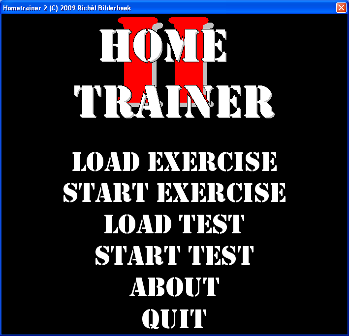
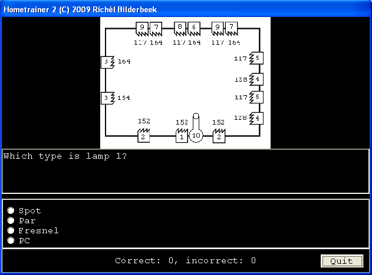
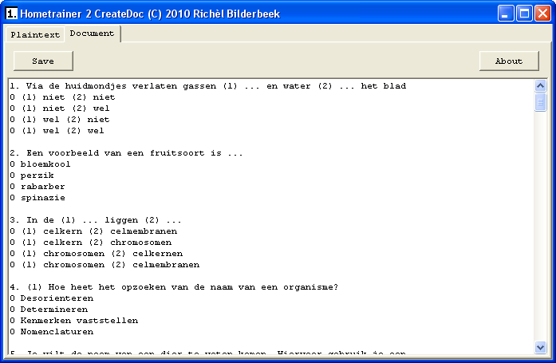
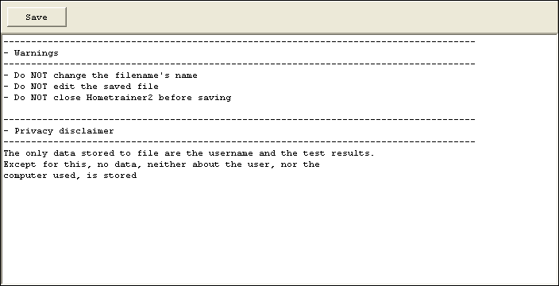
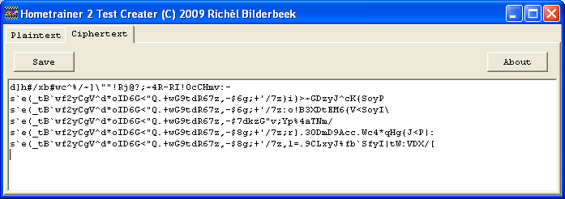
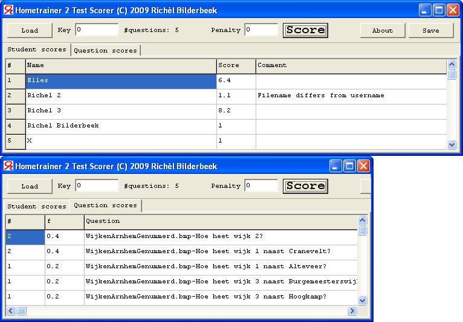
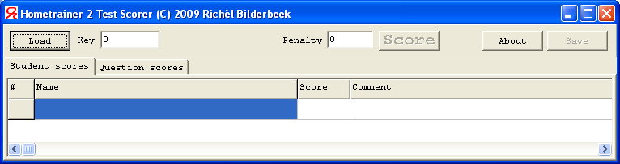

# HometrainerVcl

Branch|[](https://travis-ci.org)
---|---
master|[](https://travis-ci.org/richelbilderbeek/HometrainerVcl)
develop|[](https://travis-ci.org/richelbilderbeek/HometrainerVcl)

Hometrainer is desktop tool to train self-made exercises with open questions 
and multiple choice questions, with or without images. The exercises are
created by use of a simple text editor (Notepad, for example). 
Hometrainer can also be used for examination.















## Downloads

 * [Windows executable](http://richelbilderbeek.nl/ToolHometrainerExe_1_7.zip)

## Simple example of Hometrainer in creating exercises

Supply the program with a text file like shown below (note that the first line is obligatory):

``` 
Hometrainer (C) 2009-2015 Richel Bilderbeek
Humanbody.bmp,Which line points to the liver?,1,2,3,4
Humanbody.bmp,Which line points to the liver?,1/one/One
Humanbody.bmp,Which organ does line 1 point to?,The liver/the liver/Liver/liver
-,In which organ is ethanol detoxified?,The liver/the liver/Liver/liver
```

The program will show you the image, the question and the (shuffled) answers. You have to click the right answer. Great to train yourself in nearly anything!

# Links to similar freeware programs

 * [WordFox](http://wordfox.byethost17.com/wordfox/index.php)  
 * Drill Assistant
 * Overhoor
 * [Quiz](http://www.luziusschneider.com/QuizHome.htm): for multiple-choice questions only
 * [Questiontools Suite](http://www.questiontools.org/): extensive test generation suite, but commercial for companies
